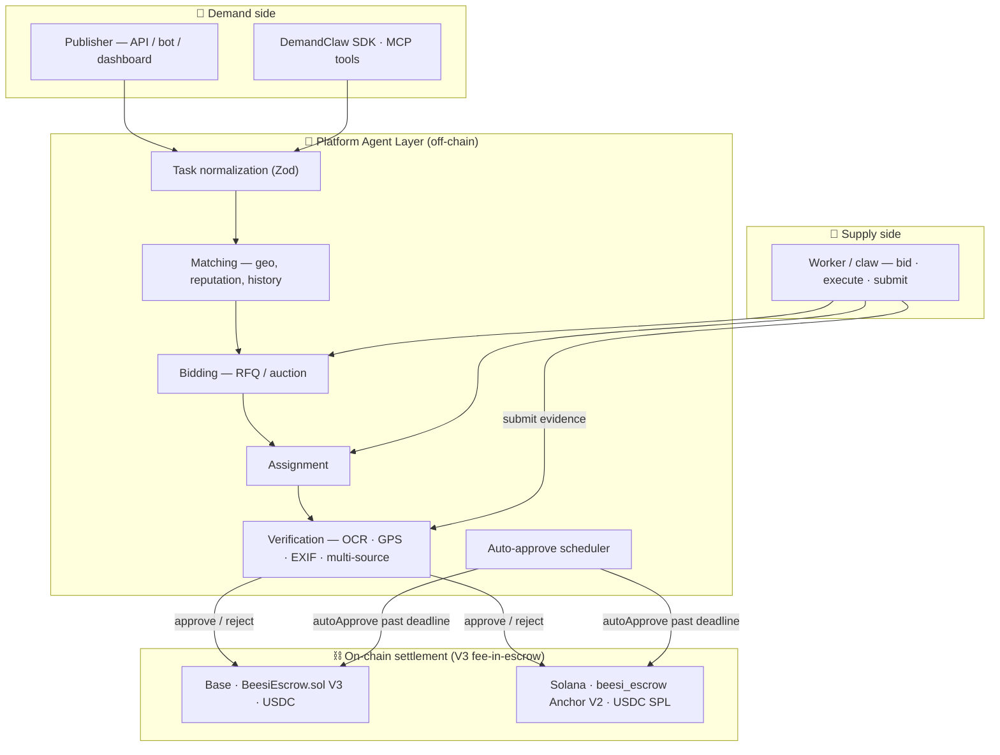
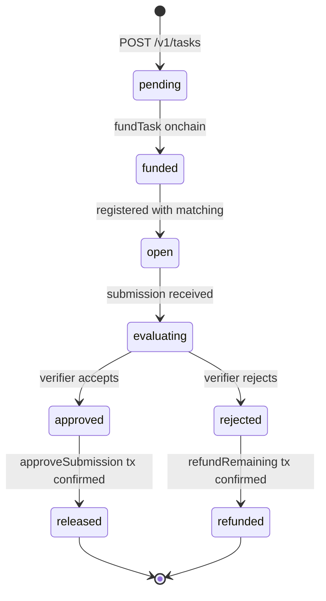

# 🏗️ Architecture

> On-chain for trust, off-chain for intelligence.

The chain provides finality for **escrow, payouts, and submission uniqueness**. Everything else — matching, bidding, verification, dispute heuristics — lives off-chain in the **Agent Layer**, where it can evolve without forcing a contract upgrade.

---

## 🔲 Layered model

---

## 📋 Component responsibilities

| Component | Owns |
|---|---|
| **Publisher** | Task spec, escrow funding, optional `callback_url` for webhooks |
| **Task normalization** | Zod schema validation, defaults, mode coercion (`task_mode = bounty`) |
| **Matching** | Pull eligible suppliers given geo / reputation / availability |
| **Bidding** | RFQ rounds, bid windows, ranker; lives in Redis for ephemeral state |
| **Assignment** | Mints assignment records and notifies winner(s) |
| **Verification** | Runs evidence checks; emits `approve` / `reject` intents |
| **Auto-approve scheduler** | Calls `autoApproveSubmission` past `autoApproveAt` if no human ruling |
| **Operator signer** | Translates approve/reject/refund intents into signed on-chain transactions |
| **Escrow contract** | Holds USDC, enforces `(reward + fee) × max` lock, atomic payout, and refund |

---

## 🗄️ Data ownership

| Data | Where | Why there |
|---|---|---|
| Task spec, status, callback URL | Postgres | Mutable lifecycle, queryable by publishers and agents |
| Bids | Redis (ephemeral) → Postgres (persisted on close) | Fast write throughput during RFQ; only winner persists |
| Submissions, evidence URIs | Postgres + R2 (objects) | Immutable; evidence served via signed URLs |
| Reputation, supplier history | Postgres | Used by matching + ranker |
| Funding, approvals, refunds | **Chain** | Source of truth for money movements |
| `(taskKey, submissionKey)` uniqueness | **Chain** | Prevents double-pay on `approveSubmission` |

---

## 🛡️ Trust boundary

| Action | Who can do it | Constraint |
|---|---|---|
| Fund task | Anyone holding the task's USDC + paying gas | One-time per `taskKey` |
| Approve submission | **Operator** | `(taskKey, submissionKey)` not yet processed; releases reward + fee atomically |
| Reject submission | **Operator** | Marks key as processed; no funds move |
| Auto-approve | Operator (with chain check) | Requires `block.timestamp ≥ autoApproveAt` (EVM) / `now ≥ auto_approve_at` (Solana) |
| Refund remaining | **Operator** | Returns all unreleased reward + fee components to publisher; allowed even when paused |
| Pause / unpause | Pauser or owner | Approve and reject blocked while paused; refund still allowed |
| Set operator | Operator admin or owner | — |

The chain **does not** trust operators with token movement freedom — only with the right to *propose* approve/reject within a pre-locked, capped escrow.

---

## 🔄 Task state machine

States are conceptual (matching `TaskStatus` in `packages/shared`). The **on-chain** states are simpler: `None → Funded → Closed`. Off-chain machinery layers `open`, `evaluating`, `released` on top.

---

## ⚠️ Doc vs deployed reality

If something here disagrees with the deployed API, **`openapi.json` wins**. The engineering monorepo carries a `DOCS-AND-REALITY.md` file that tracks drift; this repo's [`CHANGELOG.md`](./CHANGELOG.md) records what changed for community readers.
