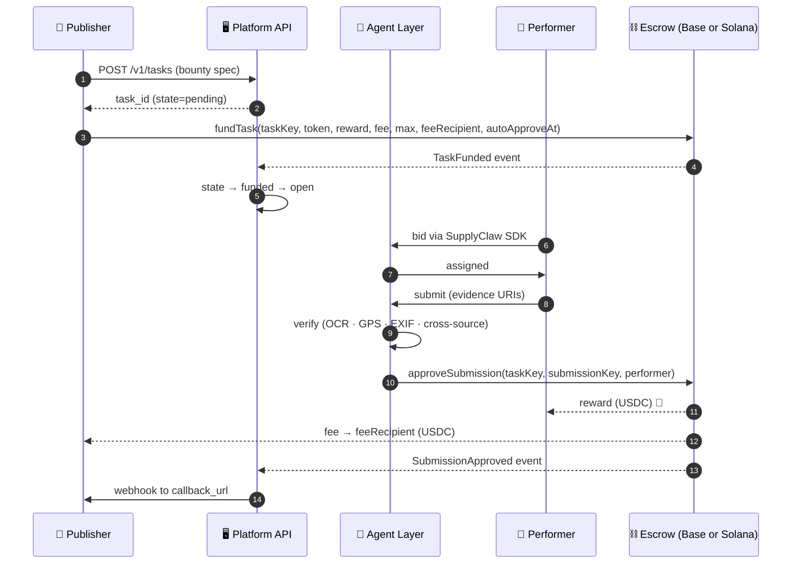
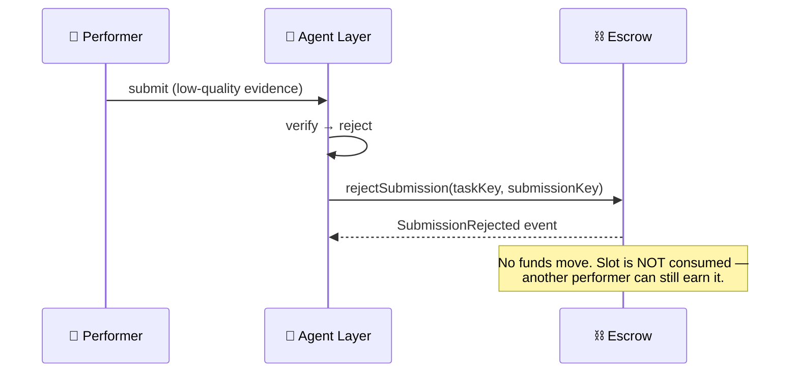
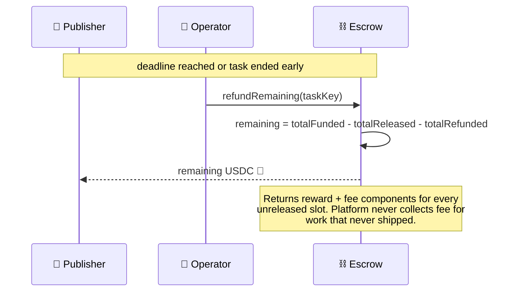
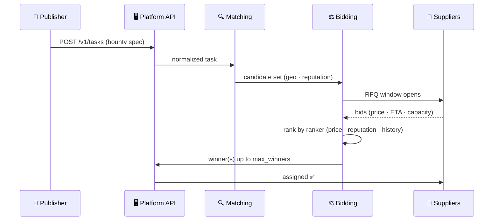
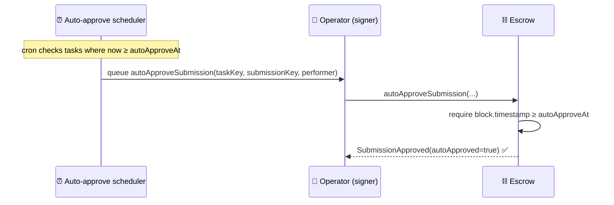

# 🔄 Workflows

Five flows worth understanding — happy path, reject, refund, RFQ, and auto-approve. Each works identically on **Base** and **Solana**; the only difference is the signing surface.

---

## 1. ✅ Happy path — fund → assign → approve

Key invariants:

- `(taskKey, submissionKey)` is processed **at most once**.
- Reward and fee transfer in the **same on-chain instruction**. No partial state.
- The task auto-closes when `releasedCount == maxInstances`.

---

## 2. ❌ Reject

**A reject does not consume an instance.** The task continues until `releasedCount == maxInstances` or `refundRemaining` is called.

---

## 3. ↩️ Refund — "未完成不收费" enforced on-chain

Allowed **even when the contract is paused** — locked publisher funds are never trapped.

---

## 4. 🏷️ RFQ / auction (off-chain)

RFQ state lives in **Redis** during the window; the winner persists to Postgres. The chain sees only the eventual `approveSubmission` calls.

---

## 5. ⏰ Auto-approve — performers don't get stuck

The chain **double-checks** the deadline itself — even an over-eager scheduler can't approve early. This is why `autoApproveAt` is a required, non-zero field on `fundTask`.

---

## 💡 Two paths to fund (same outcome)

| Path | Who signs | When to use |
|---|---|---|
| **A — direct** | Publisher | You hold keys, you sign `fundTask` yourself, then `POST /v1/tasks/:id/fund` with the tx hash |
| **B — custodial** | Platform agent wallet | `POST /v1/wallet/fund-task` or SDK `demand.fundTaskFromWallet(taskId)` — one call, platform handles signing |

The on-chain effect is identical. Path B is what the MCP server's `fund_task_custodial` tool wraps.

See [`interfaces/api/routes.md`](./interfaces/api/routes.md) for exact request bodies.
