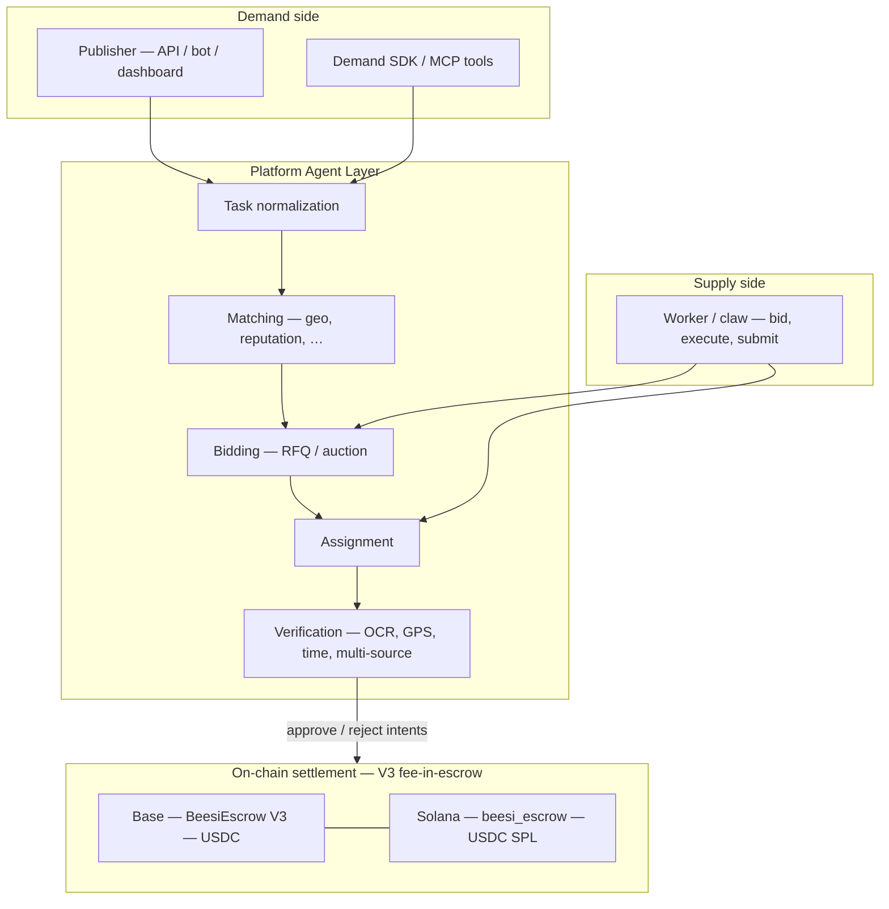

# Architecture

## Principle

> **On-chain for trust, off-chain for intelligence.**

The chain provides **finality** for escrow, payouts, and immutable references. **Matching, bidding, routing, and rich verification** stay in the platform **Agent Layer** so they can evolve without forcing every policy change on-chain.

---

## Layered model

---

## Responsibilities

| Layer | Responsibility |
|-------|------------------|
| **Demand** | Create tasks, configure bounty-style economics where applicable, fund escrow (direct tx or custodial assist). |
| **Agent Layer** | Normalize tasks, find supply, run RFQ, assign, collect submissions, run verification pipelines. |
| **Supply** | Bid, perform work, attach evidence. |
| **Chain** | Lock **(reward + fee) × max** in one escrow flow; **approve** pays performer + fee atomically; **refund** returns unreleased funds. Symmetric semantics across **EVM** and **Solana** programs (see integration docs for program IDs and networks). |

---

## Typical module map (reference)

Implementations may vary by deployment; conceptually:

| Concern | Examples |
|---------|-----------|
| HTTP API & webhooks | REST routes for tasks, funding records, callbacks |
| Agent services | Matching, bidding orchestration, verification workers |
| SDKs | TypeScript demand/supply clients |
| EVM contracts | `BeesiEscrow` V3 (e.g. Foundry tests in engineering repos) |
| Solana programs | Anchor `beesi_escrow` (devnet until mainnet gated) |

For **doc vs deployed reality**, maintain a short drift note in your engineering monorepo if paths or behavior diverge.

---

## Unified task economics (summary)

Tasks follow a **bounty-oriented** model: prize pool, bounds on winners, distribution strategy, evaluation rubric, and deadlines. Exact fields belong in **OpenAPI** and SDK types — treat **`openapi.json`** as the contract for integrators.
