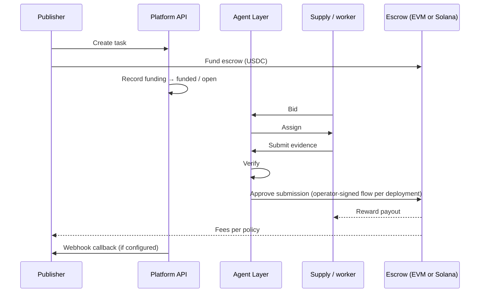

# Workflows

## End-to-end (happy path)

1. **Publish** — Client creates a task via `POST /v1/tasks` → task enters **`pending`** (or equivalent) until funded.
2. **Fund** — Escrow receives USDC through **V3 fee-in-escrow** (`fundTask`-style flow on Base or Solana). Task becomes **`funded`**, then **`open`** for bidding/supply.
3. **Match & bid** — Supply submits bids; platform runs **RFQ / auction** semantics as configured.
4. **Assign** — Winner(s) assigned to execute.
5. **Submit** — Worker submits evidence (media, metadata, proofs).
6. **Verify** — Platform verification accepts or rejects against rubric and policies.
7. **Settle** — **Approve** triggers on-chain payout (**reward → performer**, **fee → fee recipient**); **reject** follows refund policy. Optional webhook notifies **`callback_url`**.



---

## Task state machine (conceptual)

States align with shared **`TaskStatus`** in SDK/types in the engineering repo; conceptually:

```
pending → funded → open → evaluating → approved → released
                          ↘ rejected → refunded
```

Exact labels and transitions **must** match your deployed API — use **`openapi.json`** as source of truth.

---

## Operator-facing settlement

Production setups typically separate:

- **Publisher / wallet** actions (fund, possibly custodial assist via documented routes).
- **Operator** actions that **approve** or **finalize** submissions on-chain, via controlled signing paths (deployment-specific: e.g. EVM local signer vs hosted signer for Solana).

Document **your** operator deployment model in runbooks; this showcase repo only lists that such a separation exists.

---

## What stays off-chain

Examples: OCR pipelines, GPS checks, duplicate detection, reputation scoring, spam prevention. These affect **whether** an approval intent is emitted — they are **not** replicated blindly on-chain.
